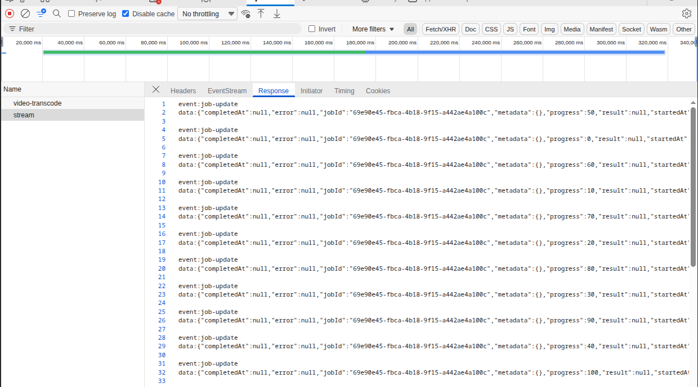
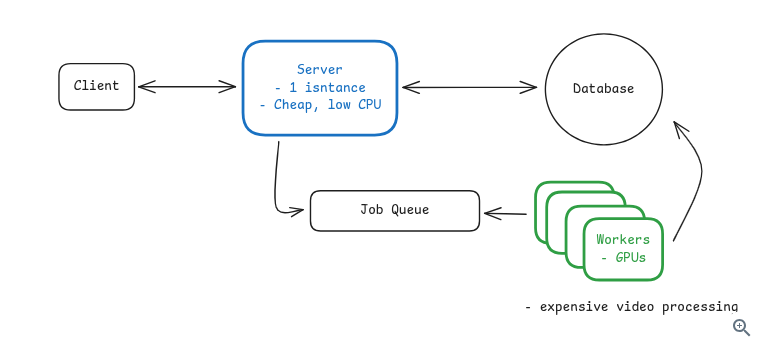

1. API GET {jobID}}/stream gửi SSE + progress (bao nhiêu % done )

2. API POST /video-transcode để gửi job cần xử lý lâu 
3. impl của https://www.hellointerview.com/learn/system-design/patterns/long-running-tasks

