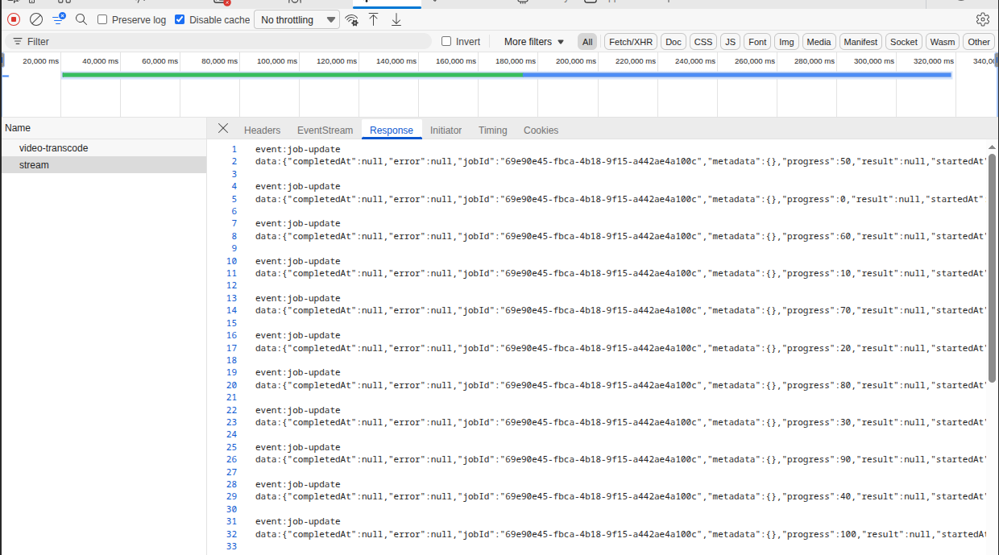
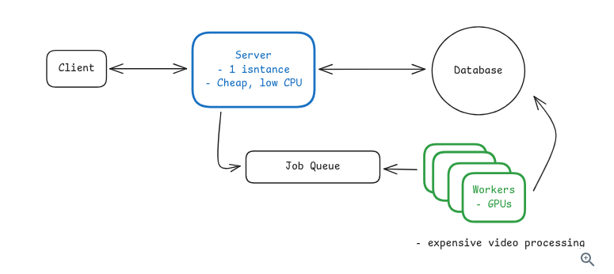
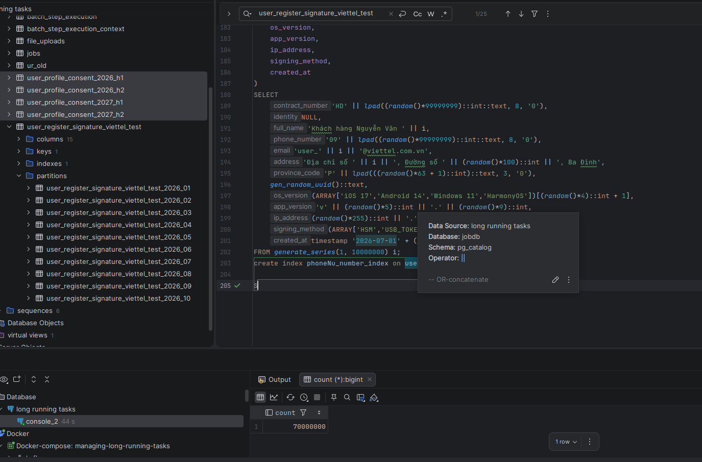
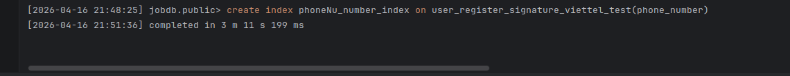
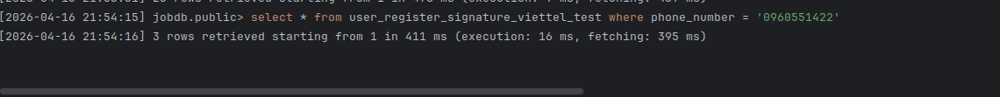
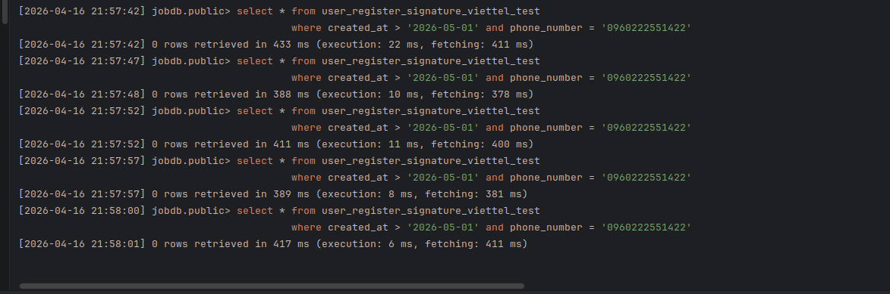
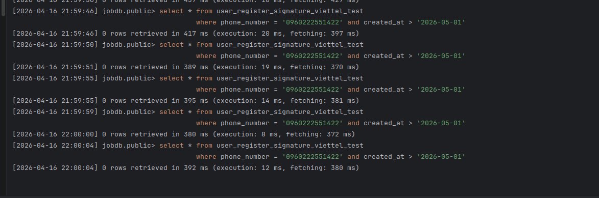
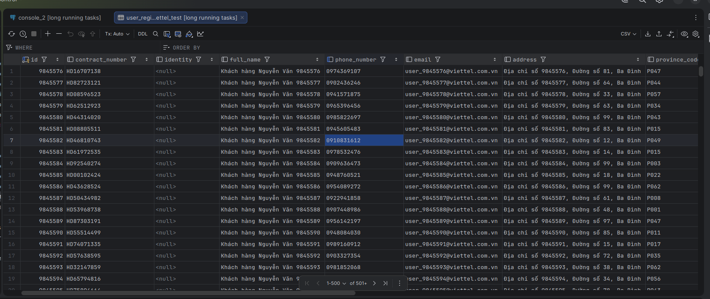
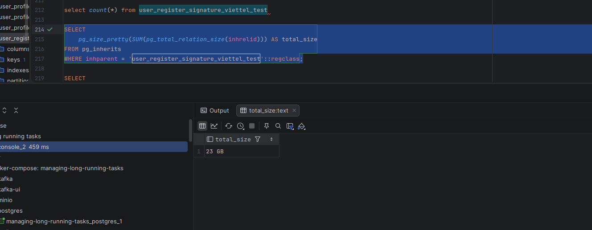

1. API GET {jobID}}/stream gửi SSE + progress (bao nhiêu % done )

2. API POST /video-transcode để gửi job cần xử lý lâu 
3. impl của https://www.hellointerview.com/learn/system-design/patterns/long-running-tasks




## index and partition with 70M records - 7 partiton, each 10M record?

```sql
CREATE TABLE user_register_signature_viettel_test (
id BIGSERIAL,
contract_number VARCHAR(20),
identity VARCHAR(12),
full_name TEXT,
phone_number VARCHAR(15),
email VARCHAR(100),
address TEXT,
province_code VARCHAR(5),
device_id VARCHAR(50),
os_version VARCHAR(20),
app_version VARCHAR(10),
ip_address VARCHAR(45),
signing_method VARCHAR(20),
request_id UUID DEFAULT gen_random_uuid(),
created_at TIMESTAMP NOT NULL DEFAULT now(),
PRIMARY KEY (id, created_at)  -- bắt buộc include partition key
) PARTITION BY RANGE (created_at);


CREATE TABLE user_register_signature_viettel_test_2026_01
PARTITION OF user_register_signature_viettel_test
FOR VALUES FROM ('2026-01-01') TO ('2026-02-01');

CREATE TABLE user_register_signature_viettel_test_2026_02
PARTITION OF user_register_signature_viettel_test
FOR VALUES FROM ('2026-02-01') TO ('2026-03-01');

CREATE TABLE user_register_signature_viettel_test_2026_03
PARTITION OF user_register_signature_viettel_test
FOR VALUES FROM ('2026-03-01') TO ('2026-04-01');

CREATE TABLE user_register_signature_viettel_test_2026_04
PARTITION OF user_register_signature_viettel_test
FOR VALUES FROM ('2026-04-01') TO ('2026-05-01');

CREATE TABLE user_register_signature_viettel_test_2026_05
PARTITION OF user_register_signature_viettel_test
FOR VALUES FROM ('2026-05-01') TO ('2026-06-01');

CREATE TABLE user_register_signature_viettel_test_2026_06
PARTITION OF user_register_signature_viettel_test
FOR VALUES FROM ('2026-06-01') TO ('2026-07-01');

CREATE TABLE user_register_signature_viettel_test_2026_07
PARTITION OF user_register_signature_viettel_test
FOR VALUES FROM ('2026-07-01') TO ('2026-08-01');

CREATE TABLE user_register_signature_viettel_test_2026_08
PARTITION OF user_register_signature_viettel_test
FOR VALUES FROM ('2026-08-01') TO ('2026-09-01');

CREATE TABLE user_register_signature_viettel_test_2026_09
PARTITION OF user_register_signature_viettel_test
FOR VALUES FROM ('2026-09-01') TO ('2026-10-01');

CREATE TABLE user_register_signature_viettel_test_2026_10
PARTITION OF user_register_signature_viettel_test
FOR VALUES FROM ('2026-10-01') TO ('2026-11-01');

SET synchronous_commit = off;
ALTER TABLE user_register_signature_viettel_test SET UNLOGGED;
```

```sql
INSERT INTO user_register_signature_viettel_test (
contract_number,
identity,
full_name,
phone_number,
email,
address,
province_code,
device_id,
os_version,
app_version,
ip_address,
signing_method,
created_at
)
SELECT
'HD' || lpad((random()*99999999)::int::text, 8, '0'),
NULL,
'Khách hàng Nguyễn Văn ' || i,
'09' || lpad((random()*99999999)::int::text, 8, '0'),
'user_' || i || '@viettel.com.vn',
'Địa chỉ số ' || i || ', Đường số ' || (random()*100)::int || ', Ba Đình',
'P' || lpad(((random()*63 + 1)::int)::text, 3, '0'),
gen_random_uuid()::text,
(ARRAY['iOS 17','Android 14','Windows 11','HarmonyOS'])[(random()*4)::int + 1],
'v' || (random()*5)::int || '.' || (random()*9)::int,
(random()*255)::int || '.' || (random()*255)::int || '.1.1',
(ARRAY['HSM','USB_TOKEN','SIM_CA'])[(random()*3)::int + 1],
timestamp '2026-06-01' + (random() * interval '30 days')
FROM generate_series(1, 10000000) i;

INSERT INTO user_register_signature_viettel_test ( -- each insert about 2 minute
contract_number,
identity,
full_name,
phone_number,
email,
address,
province_code,
device_id,
os_version,
app_version,
ip_address,
signing_method,
created_at
)
```

select count (*) from user_register_signature_viettel_test -- 70M record




create index phoneNu_number_index on user_register_signature_viettel_test(phone_number)  - just 3 minutes to index 70M records


select a phone number in 70M records just 411ms


select with partition key and phone number ~ 400ms


select with phone number and partiton key ~ 400ms



example data 


total disk size = 23GB
